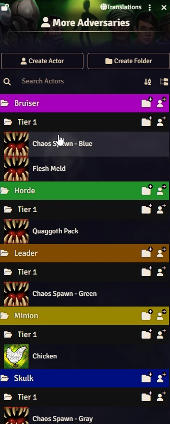
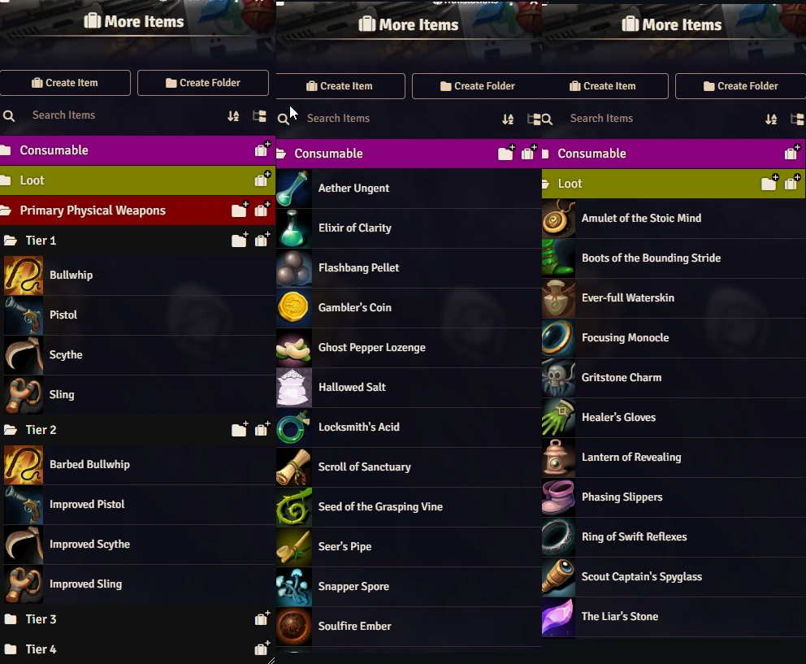
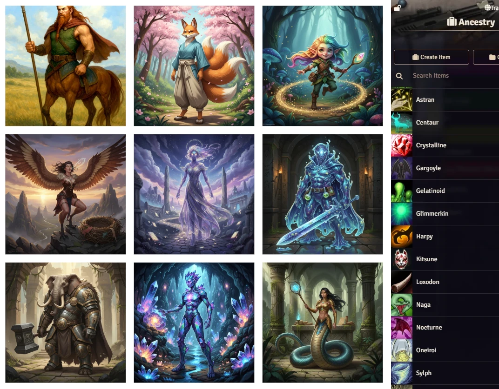
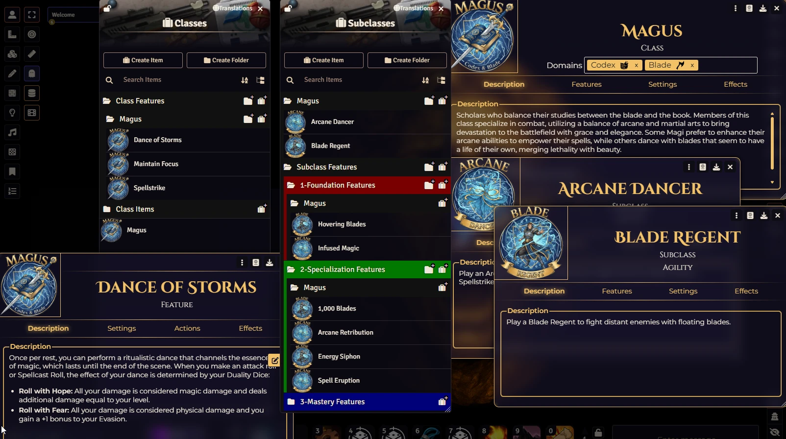
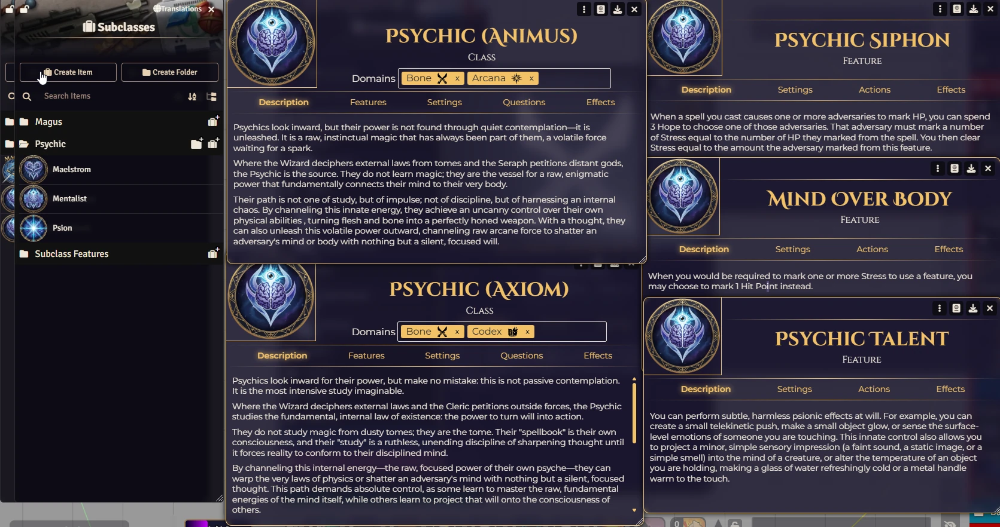

# Daggerheart - Extra Content

Homebrew content for Daggerheart.

[](https://buymeacoffee.com/mestredigital) [](https://mestredigital.online/pages/projetos-en)

## More Adversaries Compendium

Community-built adversaries! Share yours too at this [link](https://github.com/brunocalado/daggerheart-extra-content/issues).

<p align="center">
  
</p>

## More Items Compendium

Includes Armors, Weapons, Loot, and Consumables.

<p align="center">
  
</p>

## More Ancestries Compendium

<p align="center">
  
</p>

## Curses Compendium

A comprehensive collection of curses.

## New Classes

### Magus

<p align="center">
  
</p>

### Psychic (Animus) and Psychic (Axiom)

<p align="center">
  
</p>

## Assets

- [Turn Marker](turn-markers)
- [Token Frame](token-frames)
- [Bar Brawl](bar-brawl)

# Installation

## Automatic Installation

Search for **Daggerheart - Extra Content** in the Foundry VTT module browser.

## Manual Installation

1. Copy the link below.
2. Go to the **Add-on Modules** tab in Foundry VTT.
3. Click **Install Module**.
4. Paste the link into the **Manifest URL** field.

**Link:** 

```
https://raw.githubusercontent.com/brunocalado/daggerheart-extra-content/main/module.json
```

# Acknowledgments

- @xayentist 
- @groovything 
- @joaquinp98 
- @o.frutuoso 
- @flameofwar 

# Changelog

You can read the full list of changes in the [Changelog](CHANGELOG.md).

# License

Code license available at [LICENSE](LICENSE).

The images for Ancestries and Adversaries are AI-generated, so they are under the [public domain](https://creativecommons.org/publicdomain/zero/1.0/).

sfx-critical: https://pixabay.com/service/license-summary/

# 🧰 My Daggerheart Modules

| Module | Description |
| :--- | :--- |
| 💀 [**Adversary Manager**](https://github.com/brunocalado/daggerheart-advmanager) | Scale adversaries instantly and build balanced encounters in Foundry VTT. |
| 🌟 [**Best Modules**](https://github.com/brunocalado/dh-best-modules) | A curated collection of essential modules to enhance the Daggerheart experience. |
| 🐉 [**Colossus**](https://github.com/brunocalado/dh-colossus) | Manage massive multi-part boss encounters with independent HP per part and a single shared stress pool. |
| 💥 [**Critical**](https://github.com/brunocalado/daggerheart-critical) | Animated Critical. |
| 💠 [**Custom Stat Tracker**](https://github.com/brunocalado/dh-new-stat-tracker) | Add custom trackers to actors. |
| ☠️ [**Death Moves**](https://github.com/brunocalado/daggerheart-death-moves) | Enhances the Death Move moment with a dramatic interface and full automation. |
| 📏 [**Distances**](https://github.com/brunocalado/daggerheart-distances) | Visualizes combat ranges with customizable rings and hover calculations. |
| 📦 [**Extra Content**](https://github.com/brunocalado/daggerheart-extra-content) | Homebrew for Daggerheart. |
| 🤖 [**Resource Macros**](https://github.com/brunocalado/daggerheart-fear-macros) | Automatically executes macros when the Fear or Hope resources are changed. |
| 😱 [**Fear Tracker**](https://github.com/brunocalado/daggerheart-fear-tracker) | Adds an animated slider bar with configurable fear tokens to the UI. |
| 🧟 [**Horde**](https://github.com/brunocalado/dh-horde) | Explode single horde tokens into dozens of individual tokens and manage their movement and stats automatically. |
| 🎁 [**Mystery Box**](https://github.com/brunocalado/dh-mystery-box) | Introduces mystery box mechanics for random loot and surprises. |
| ⚡ [**Quick Actions**](https://github.com/brunocalado/daggerheart-quickactions) | Quick access to common mechanics like Falling Damage, Downtime, etc. |
| 📜 [**Quick Rules**](https://github.com/brunocalado/daggerheart-quickrules) | Fast and accessible reference guide for the core rules. |
| 🎲 [**Stats**](https://github.com/brunocalado/daggerheart-stats) | Tracks dice rolls from GM and Players. |
| 🧠 [**Stats Toolbox**](https://github.com/brunocalado/dh-statblock-importer) | Import using a statblock. |
| 🛒 [**Store**](https://github.com/brunocalado/daggerheart-store) | A dynamic, interactive, and fully configurable store for Foundry VTT. |
| 🔍 [**Unidentified**](https://github.com/brunocalado/dh-unidentified) | Obfuscates item names and descriptions until they are identified by the players. |

# 🗺️ Adventures

| Adventure | Description |
| :--- | :--- |
| ✨ [**I Wish**](https://github.com/brunocalado/i-wish-daggerheart-adventure) | A wealthy merchant is cursed; one final expedition may be the only hope. |
| 💣 [**Suicide Squad**](https://github.com/brunocalado/suicide-squad-daggerheart-adventure) | Criminals forced to serve a ruthless master in a land on the brink of war. |