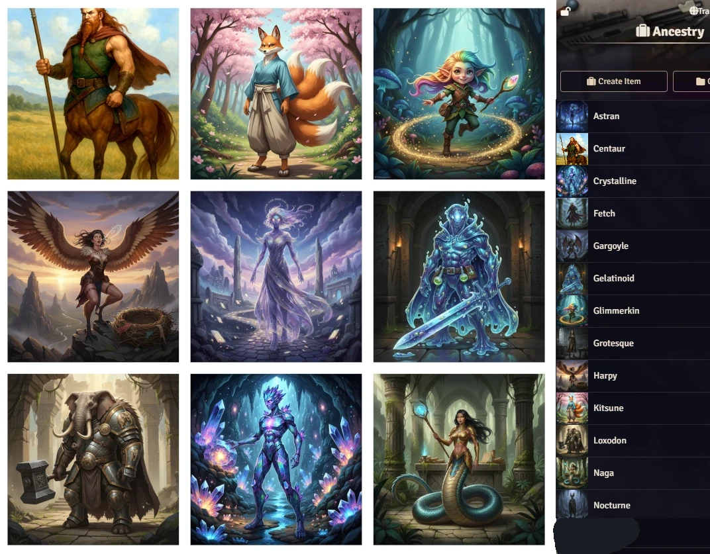

# Daggerheart - Extra Content
Resources for Daggerheart

## Macros
- Create Random PC: create a random PC
- Downtime
- Roll Loot and Roll Consumable
- Request Roll
- Macros for Light
- Avoid Death - Scar Check 
- Help an Ally
- Spotlight this Token!
- Beastform
- Falling And Collision Damage
- System Probability

### Macro: Aeris Cinematic Crits
You can use **Aeris Cinematic Crits** module with Daggerheart system. Follow the steps:
1. Import the macro **AerisCinematicCritsforDaggerheart** to the world.
2. Go to Configure Settings.
3. Go to Aeris Cinematic Crits Settings.
4. Change **Crit Mode** to **Use Custom Macro**
5. Paste **AerisCinematicCritsforDaggerheart** into **Crit Macro Name** field.
6. When a PC rolls a critical it should trigger the animation.
7. You need to set the macro permission to Observer to all players.

## More Adversaries Compendium
Community build adversaries! Share yours too at [link](https://github.com/brunocalado/daggerheart-extra-content/issues).

  

## More Items Compendium
- Weapons, Loot and Consumables

  

## More Ancestries Compendium

  

## Curses Compendium
Curses compendium

## Motherboard Frame
- Compediums with tables and items 
- Macro: Scrap Reward  
- Macro: Scrap Shop

  

## New Classes

### Magus

  

### Magus

  

## Adversaries Features Compedium
All adversaries features in one compedium to make easy to create new adversaries.

## Loot and Consumable
Include macro to make easy roll the tables.

  

## Assets
- [Turn Marker](turn-markers)
- [Token Frame](token-frames)
- [Bar Brawl](bar-brawl)

# Instalation
## Instalation
Search for Daggerheart - Extra Content on Foundry VTT modules.

## Manual Instalation
Go to **modules** and paste the link. 
Link: https://raw.githubusercontent.com/brunocalado/daggerheart-extra-content/main/module.json

# Acknowledges
- @xayentist 
- @groovything 
- @joaquinp98 
- @o.frutuoso 
- @flameofwar 

# Changelog
You can read changes at [Changelog](CHANGELOG.md)

# License
Code license at [LICENSE](LICENSE).

The images for Ancestries, Adversaries are AI, so they are under [public domain](https://creativecommons.org/publicdomain/zero/1.0/).

sfx-critical: https://pixabay.com/service/license-summary/